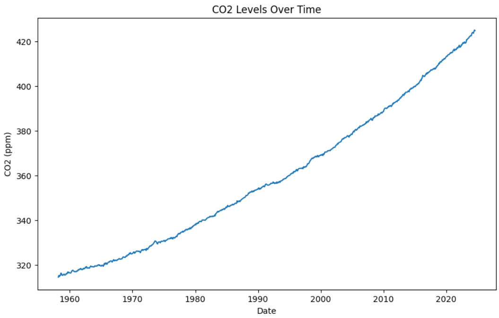
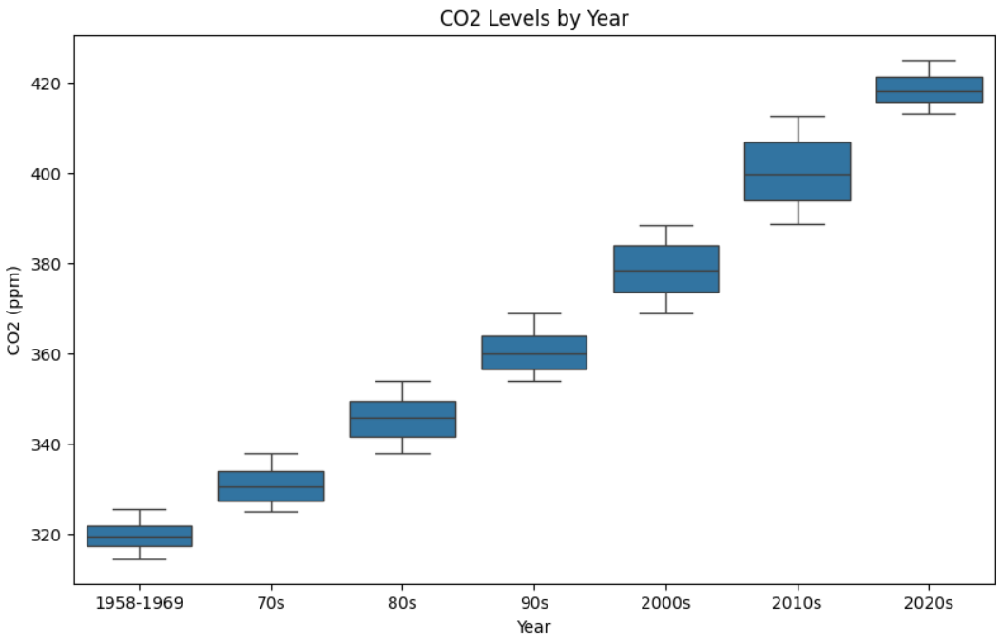

# CO2 PPM - Trends in Atmospheric Carbon Dioxide

How CO2 Level in Hawaii have increased to date?

## Dataset Description

(dataset_description) - [text form] This will be a brief description of the dataset that you have chosen for the project.

## Summary of Findings

(summary_of_findings) - [text form] This will be a brief summary of the findings of the project.

## Data Preprocessing

(data_preprocessing) - [text form] This will be a brief description of the data preprocessing steps that you have taken to clean and prepare the dataset for analysis.

## Exploratory Data Analysis

### Visualization

## Model Development

(model_development) - [text form] This will be a brief description of the model development process that you have taken to create the model for the project.

## Model Evaluation

(model_evaluation) - [text form] This will be a brief description of the model evaluation process that you have taken to evaluate the model's performance for the project.

## Conclusion

(conclusion) - [text form] This will be a brief conclusion of the project, summarizing the key findings and insights from the analysis.

## Contributors

Manuel E. Mendez. Jr., Kiyoharu Sarmiento, and Rijel S. Tayag

